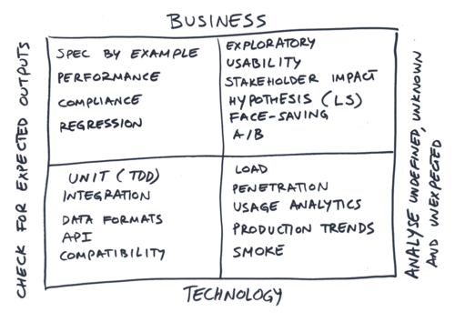

# Executable Specifications

Executable Specifications, simply put, are documents explaining a software system that can automatically be executed -- validated against the software that they are explaining. The three popular usages for such documents are:

* _Definition of done/Acceptance tests_: When a shared agreement of planned features gets captured as a human-readable document with examples, such documents can be used by developers as part of their definition of done. Such documents can capture the expectations of business stakeholders, testers, and subject matter experts. Ideally, a developer should not allowed to claim that a piece of work is complete until the document can be successfully validated against the system. Note that executable specifications are typically only a part of the definition of done, so other types of checks or tests may be required to fully declare victory. However, executable specifications can make the process of checking for expected outcomes fast and objective, especially from a business-domain perspective. 
* _Living documentation_: When documents can be validated easily and quickly, it's easy to discover which specifications no longer reflect system behaviour. When executable specifications are validated frequently and organised well, they form an excellent basis for a documentation system that is easy to maintain, and removes information bottlenecks from the process. This makes it easier to onboard new team members, and allows non-technical users to reliably investigate impacts of proposed changes on their own, even if they can't or do not know how to access the underlying source code.
* _Regression checks_: Re-validating documents that explain previous functionality can support teams in preventing functional regressions.

The most frequent use case for Executable Specifications is to support Specification by example is (also known as example-driven development, executable requirements, acceptance test-driven development, ATDD or A-TDD, Agile Acceptance Testing), within the context of Behaviour Driven Development.

## Advantages

This approach is particularly successful for managing requirements and functional tests on large-scale projects of significant domain and organisational complexity. Successful application of Specification by example is [documented](http://amzn.to/1UnTzSJ) to significantly reduce feedback loops in software development, leading to less rework, higher product quality, faster turnaround time for software changes and better alignment of activities of various roles involved in software development such as testers, analysts and developers.

## How do Executable Specifications fit into testing?

Executable specifications can be a very effective way to capture the expectations of various team members and stakeholders and provide evidence that those aspects of a system were validated.

In the context-driven testing terminology, they can be an effective way for the whole team to define checks, and delegate checking to the developers actually working on a related piece of code. 

On the spectrum of tests that a team might consider, executable specifications are most useful for the business-oriented tests checking for expected outcomes -- the upper-left corner of the testing quadrants. For tests looking at things from a technical perspective, all the interested readers know the relevant programming language and testing tools, so it's easier and faster to just use a technical tool, typically the unit testing framework that the team is familiar with. For tests looking at non-deterministic and exploring unexpected results, it's not practical to capture the expectations (otherwise they would be expected outcomes), so any kind of automation would not be looking at the system from the right perspective.

## How to get the most out of Executable Specifications?

For the best results, get a cross-functional group of people together around a whiteboard or a flip-chart to capture key examples of the expected behaviour, and discuss them until everyone feels that they have enough information to proceed. Collaboration is critical as it helps groups reach shared understanding. Avoid any single person writing the key examples on their own, even if that person is the product manager or business representative. 

Try to capture the perspectives of domain experts, testers and developers with the key examples (so don't just focus on the happy cases - key examples means that all critical perspectives should be covered). 

Once you've agreed on the key examples, you can refine and capture them as an Executable Specification. For tips on how to do this effectively with DaSpec, check out the [Good specification/test design guidelines](how_to_write_specifications.md).

## Resources for further research

Here are some useful pointers for further study about this topic:

* [Specification by Example - How Successful Teams Deliver The Right Software](http://amzn.to/1UnTzSJ) by Gojko Adzic, ISBN 978-1617290084
* [Fifty Quick Ideas To Improve Your Tests](http://amzn.to/1eT2sn9) by Gojko Adzic, David Evans and Tom Roden, ISBN  978-0993088117
* [Practices for Scaling Lean & Agile Development: Large, Multisite, and Offshore Product Development with Large-Scale Scrum](http://amzn.to/1Ipt7QR) by Craig Larman and Bas Vodde, ISBN 978-0321636409
* [Agile Testing](http://amzn.to/1IHnGfB) by Lisa Crispin and Janet Gregory, ISBN 978-0321534460
* [Continuous Delivery](http://amzn.to/1eT37Fd) by Jez Humble and David Farley, ISBN 978-0321601919
* [The Cucumber Book: Behaviour-Driven Development for Testers and Developers](http://amzn.to/1eT2QSu) by  Matt Wynne and Aslak Hellesoy, ISBN 1934356808
* [FIT for Developing Software](http://amzn.to/1IHnb54) by Ward Cunningham and Rick Mugridge, ISBN 978-0321269348

