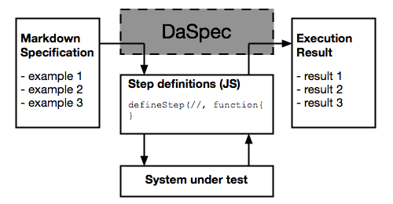

# Hello World walk-through

This page provides an in-depth explanation for getting started with DaSpec, using a trivial example to connect a markdown executable specification with a single JavaScript step definition and a very simple system under test. 

The purpose of this page is to get people started with automatic DaSpec specifications in five minutes or less. 

If you're looking for information on how to write DaSpec documents, and you don't care about automating, don't bother with this page. Just start with [How To Write Specifications With DaSpec](how_to_write_specifications.md).

Try this example live in your browser, and experiment with the values: <a href="../examples/hello_world">Hello World Example</a>

## Prerequisites

To understand this walkthrough, you'll need to know the basics of:

* [Markdown syntax](https://github.com/adam-p/markdown-here/wiki/Markdown-Cheatsheet)
* [Regular expressions](https://developer.mozilla.org/en/docs/Web/JavaScript/Guide/Regular_Expressions)
* JavaScript

## Basic Idea

DaSpec works by reading in a markdown document, extracting examples to execute, and then evaluating the examples against a system under test. It then combines the results of the checks with the original Markdown document to produce a human readable test result, marking successful and failed expectations, and where possible providing the actual and expected values for easier troubleshooting. 

As a developer using DaSpec, you'll need to tell it how to connect to your system -- effectively implementing an integration API. Each executable line of the Markdown file is tested against a set of text patterns you provide, and with each text pattern you can specify the function to receive the examples from the line. In the DaSpec model, the text pattern and the function you provide to interpret the corresponding line is called a **Step Definition**.

DaSpec does all the heavy lifting of format conversions and parsing -- all you have to do is to explain what the individual parts of the examples mean, and how to pass them on to your system under test. 

## System under test

To make things a bit more concrete, we'll be executing a specification against a JavaScript function. For this example, a simple string concatenator will do, but in real projects this will be your domain services, utility functions, API endpoints, or some other piece of code you want to check. 

    function greetingFor (subject) {
	    return 'Hello, ' + subject + '!';
    }

## Specification

The specification document explains what you expect the system under test to do. Ideally, it explains it in a human readable-form, so that your stakeholders and team members can easily understand it. Likewise, it should demonstrate the functionality with key examples, that make things concrete and prevent misunderstanding. In this case, we'll use just one example -- when we want to greet the entire world, the greeting should be __Hello, World!__. In a real project, your specifications should have plenty of examples that demonstrate the functionality from all relevant perspectives.

DaSpec can work on any MarkDown document, so you can explain the context nicely, include links to external resources and other specifications, even cross-link specifications. Any headers, block-quotes, lines with images and footnotes are just ignored. The remaining lines - plain text, links and tables, are parsed for examples to execute. In the Markdown syntax, a line starting with a hash (#) is a heading. So in the example below, the first line will be ignored and just copied to the output, and the second line will be executed.

    # this is a heading 

    The right way to greet the World is "Hello, World!"

Use headings and block-quotes to explain the purpose of the examples and help readers understand them better.

## Step definition

To enable DaSpec to connect to the system under test, we need to give it a text pattern for the examples it needs to understand. In this case, we want it to understand the sentence __The right way to greet the World is "Hello, World!"__, and pull out the words __World__ and __Hello, World!__, using the first block as an argument, and the second one as the expected result of the function we're testing. To do that, we need to supply a step definition, using the DaSpec function __defineStep__. 

The function __defineStep__ has two arguments. The first one is the regular expression that will match the line, with groups in brackets to match the arguments and expectations. The second argument of __defineStep__ is a JavaScript function that will receive the extracted parameters and evaluate them.

    defineStep(/The right way to greet the (.*) is "(.*)"/, function (subject, expectedGreeting) {
    	var actualResult = greetingFor(subject);
    	this.assertEquals(expectedGreeting, actualResult, 1);
    });

In this example, we're providing a definition for a step that will execute any lines matching __The right way to greet the ... is "..."__ format. The __(.*)__ syntax in a regular expression means any group of characters. So this step definition will also work for lines such as __The right way to greet the Sun is "Hello, Sun!"__ and similar. 

DaSpec extracts the bracket groups from the regular expression match and passes them to the function defined in the step. So when the function from the step definition gets called using our earlier specification, the __subject__ argument will equal __World__, and the __expectedGreeting__ argument will equal __Hello, World!__.

From that point, the function can do whatever it needs to connect to the system under test. This part is under your control. So you can pre-populate database records, create files, connect to API endpoints using REST or just talk directly to another JavaScript object. In this simple case, we're calling the __greetingFor__ function directly.

Finally, the step function runs an assertion, to compare the expected and the actual results. It uses the __assertEquals__ utility function to compare two values for equality. The order of arguments is very important for correct reporting. The first argument is the expected value, then the actual one. 

The third, optional, argument to the __assertEquals__ function is the index of the value we're testing in the list of regular expression match groups. This allows DaSpec to report failures in a way that makes it easy to troubleshoot, by listing expected and actual values next to eachother in the right place of the result document. The index is zero-based. Because the expected greeting is in the second match group, zero-based index is 1.  

## Results

When DaSpec runs the initial specification, it will produce a Markdown result stating how many lines it executed, how many assertions passed or failed, and bolding the correct expectations:

> > **In da spec:** executed: 1, passed: 1
>
> # this is a heading 
>
> The right way to greet the World is "**Hello, World!**"

If the actual value coming out of the system under test differs from the expectation, DaSpec will mark the failure and print the expected and the actual value.

> > **In da spec:** executed: 1, failed: 1
>
> # this is a heading
> 
> The right way to greet the World is "**<del>Hello, Mike!</del> [Hello, World!]**"

## Where next?

Try this [example in your browser](../examples/hello_world). Add lines to the specification, and try to word things differently and create another step definition that will match the different lines. 

When you're ready to move on, see [Syntax Examples](../examples) for how to use tables and lists.
