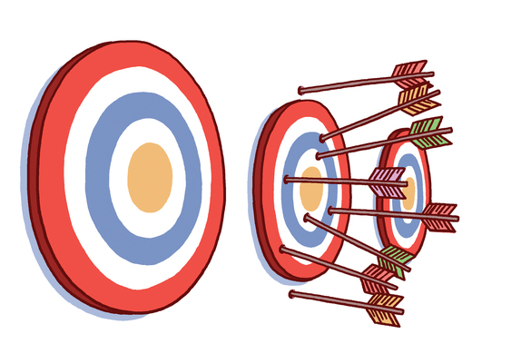

> This is a chapter from the book [Fifty Quick Ideas To Improve Your Tests](http://fiftyquickideas.com/fifty-quick-ideas-to-improve-your-tests/), used with permission by the authors.
> The content is copyrighted by Neuri Consulting LLP. 

#Cover a single topic

Lack of focus is a symptom of problematic tests that is relatively easy to
spot.  Common examples of lack of focus are multiple actions that are covered
by a single test and sequences of actions that are executed multiple times with
slightly different parameters.  In the Given-When-Then structure of examples,
this symptom translates to multiple 'When' statements, or a single 'When'
statement that uses conjunctions.

If a test executes multiple tasks that together create a higher-level action,
it is often a sign that it is tightly coupled to a particular technical
workflow. Such tests are often written after development and rely on
implementation details, which makes them fragile. Here is a typical example:

  When the user submits the payment details
  and the admin approves the payment
  and the payment is scheduled
  and the payment is executed by the payment channel
  and the payment is sent to the counterparty
  and the payment confirmation arrives from the counterparty
  and the payment confirmation is loaded by the payment channel

This example lists individual steps that happen in a particular implementation
that has two asynchronous modules. If the way technical components are
coordinated changes in the future, the test will break even if none of the
business rules change, nor the software implementation of payment processing. A
particularly problematic category of such tests are those where tasks or
actions rely on user interface details. 

A test that executes multiple interdependent actions is fragile and often costs
a lot to maintain. Actions within a sequence depend on the results of preceding
actions, so small changes in one such action can cause fake alerts and failures
in the expectations for other actions. Such tests are difficult to troubleshoot
and fix, because interdependencies make it difficult to understand and change
expectations correctly. 

Each test should ideally be focused on one topic. Each topic should ideally
described by one test. Watch out for multiple 'When' clauses, actions with
conjunctions and scenario names that suggest a lack of focus. Break them down
into several independent tests, and you will get a lot more value out of them.

##Key benefits

Several independent tests for different actions are much easier to maintain
than one overall test that validates everything. When one of the actions
changes, it is easier to understand the impact on the test and adjust
expectations, because the impact is localised. Similarly, changes to tests for
one action do not require changes to tests for other actions, but this is
impossible to prevent with a single overarching test. 

When tests are focused on one particular action, it's easier to argue about
completeness and add more contextual examples around important boundary
conditions for that particular action. Tests that execute multiple actions
suffer from a combinatorial explosion of potential boundary conditions, so they
often just check one scenario rather than exploring important boundaries.

Independent tests also allow faster feedback. When developers work on one of
the actions, they can run only the specific tests for that action instead of
waiting for the other actions to complete as well. 

##How to make it work 

There are several good strategies for cleaning up tests that execute multiple
actions, depending on the dependencies between the actions.

If a test executes multiple tasks in sequence that form a higher-level action,
often the language and the concepts used in the test explain the mechanics of
test execution rather than the purpose of the test, and in this case the entire
block can often be replaced with a single higher-level concept.  Here is an
example:

    When the payroll is submitted for approval
    And the payroll is approved
    And the payments are queued
    And the payslips are generated
    And employees receive the payment

If the individual steps show important preconditions, and for example we want
to test what happens if the payments are not queued, such conditions should
move to a 'Given' clause rather than staying in a 'When' clause. 

If the individual steps do not show important variations, but are executed in
sequence just because of the technical flow of implementation, then the entire
block can be replaced by a single higher-level action, such as:

    When the payroll is processed

See the section on [_Describe what, not how_](idea_specify_what_not_how.md) for some
ideas on how to deal with such cases. 

If a test executes multiple interdependent actions because they rely on
similar parameters and reuse outputs, it's best to split them into individual
scenarios. A good technique for this is to:

1. Group all common parameters into a single set-up block (in the
   Given-When-Then structure this would normally go into a common _Background_
   section).
2. Build a separate scenario for each 'When' clause, listing all individual
   parameters required for it directly. Avoid any actions in the 'Given' clause, instead
   specify the preconditions as values
3. Split the 'Then' clauses of the original test and assign them to the relevant
   focused scenario.
4. Evaluate scenarios without a 'Then' clause, because they do not actually
   check anything. If they were there just to set up the context for some
   other scenario, delete them. If they describe an important aspect of the
   system, add the relevant expectations.
