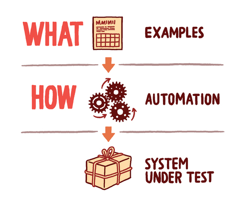

> This is a chapter from the book [Fifty Quick Ideas To Improve Your Tests](http://fiftyquickideas.com/fifty-quick-ideas-to-improve-your-tests/), used with permission by the authors. 
>The content is copyrighted by Neuri Consulting LLP. 

#Specify what, not how

By far the most common mistake inexperienced teams make when describing
acceptance criteria for a story is to mix the mechanics of test execution with
the purpose of the test. They try to describe _what_ they want to test and _how_
something will be tested all at once, and get lost very quickly.

Here is a typical example of a description of how something is to be tested:

    Scenario: basic scenario 
    Given the user Mike logs on 
    And the user clicks on "Deposit" 
    And the page reloads 
    Then the page is "Deposit" 
    And the user clicks on "10 USD" 
    And the page reloads 
    Then the page is "Card Payment" 
    When the user enters a valid card number 
    And the user clicks on "Submit" 
    And the payment is approved 
    And the page reloads 
    Then the page is "Account" 
    And the account field shows 10 USD 
    And the user clicks on "Find tickets" 
    And the user clicks on "Quick trip" 
    And the page reloads 
    Then the page is "Tickets" 
    And the price is 7 USD 
    And the user clicks on "Buy tickets"  
    Then the purchase is approved 
    And the page reloads 
    And a ticket confirmation number is displayed 
    And the account field shows 3 USD

This is a good test only in the sense that someone with half a brain can follow
the steps mechanically and check whether the end result is 3 USD. It is not a
particularly useful test, because it hides the purpose in all the clicks and
reloads, and leaves the team with only one choice for validating the story. Even
if only a tiny fraction of the code contains most of the risk for this scenario,
it's impossible to narrow down the execution. Every time we need to run the
test, it will have to involve the entire end-to-end application stack.  Such
tests unnecessarily slow down validation, make automation more expensive, make
tests more difficult to maintain in the future, and generally just create a
headache for everyone involved.

An even worse problem is that specifying acceptance criteria like this pretty
much defeats the point of user stories -- to have a useful conversation. This
level of detail is too low to keep people interested in discussing the
underlying assumptions.   

Avoid describing the mechanics of test execution or implementation details with
user stories. Don't describe _how_ you will be testing something, keep the
discussion focused on _what_ you want to test instead. For example:

    Scenario: pre-paid account purchases 
    Given a user with 10 USD in a pre-paid account 
    When the user attempts to buy a 7 USD ticket 
    Then the purchase is approved 
    And the user is left with 3 USD in the account

When most of the clutter is gone, it's easier to discuss more examples. For
example, what if there is not enough money in the account? 

|Pre-paid balance   |Ticket cost  |Purchase status|Resulting balance|
|-------------------|-------------|---------------|-----------------| 
|10 USD             |7 USD        |approved       |3 USD            | 
|5  USD             |7 USD        |rejected       |5 USD            |

This is where the really interesting part comes in. Once we remove the noise,
it's easy to spot interesting boundaries and discuss them. For example, what if
the pre-paid balance is 6.99 and someone wants to buy a 7 USD ticket?  

As an experiment, go and talk to someone in sales about that case -- most likely
they'll tell you that you should take the customer's money. Talk to a developer,
and most likely they'll tell you that the purchase should be rejected.  Such
discussions are impossible to have when the difficult decisions are hidden
behind clicks and page loads.

##Key benefits

It's much faster to discuss what needs to be done instead of how it will be
tested in detail, so keeping the discussion on a higher level allows the team to
go through more stories faster, or in more depth. This is particularly important
for teams that have limited access to business sponsors, and need to use their
time effectively.

Separately describing the purpose and the mechanics of a test makes it easier to
use tests for communication and documentation. The next time
a team needs to discuss purchase approval rules with business stakeholders, such
tests will be a great help. Although the mechanics of testing will probably be
irrelevant, a clear description of what the current system does will be an
excellent start for the discussion. In particular it will help to remind the
team of all the difficult business decisions that were made months ago while
working on previous stories. An acceptance criterion that mixes clicks and page
loads with business decisions is useless for this.

Decoupling _how_ something will be tested from _what_ is being tested
significantly reduces future test maintenance costs. When a link on a web page becomes a
button, or users are required to log in before selecting products, we only have
to update the mechanics of testing. If the purpose and the mechanics are mixed
together, it is impossible to identify what needs to change. That's the reason
why so many teams suffer from record-and-replay test maintenance.

##How to make it work

A good rule of thumb is to split the discussions on _how_ and _what_ into two
separate meetings. Business sponsors are most likely not interested in the
mechanics of testing, but they need to make decisions such as the $6.99
purchase. Engage decision-makers in whiteboard discussions on what needs to be
tested, and postpone the discussion on how to test it for the delivery team
later. 

Keep the human-readable level focused on what needs to
be tested, and keep the automation level focused on how you're checking the
examples. If you use a different tool, then clearly divide the purpose of the test
and the mechanics of execution into different layers. 
